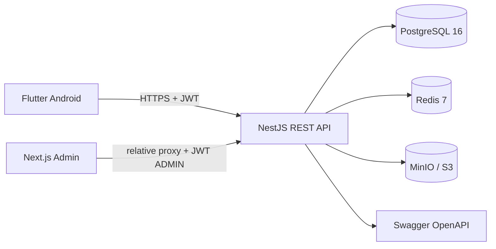

# KinoTV arxitekturasi

## Backend qatlamlari

- Controller: URI, DTO, Swagger va guardlar.
- Service: biznes qoidalari va transactionlar.
- Prisma: relation, unique constraint va optimallashtirilgan querylar.
- Common: global validation, Uzbek xatolar, Helmet, CORS, throttling, RBAC.
- Redis: 60 soniyali bosh sahifa keshi; Redis uzilsa API xavfsiz tarzda DBga o‘tadi.
- S3: backend 5 daqiqalik presigned PUT URL beradi, DBda faqat URL saqlanadi.

## Ma’lumotlar modeli

Asosiy jadvallar: `users`, `admins`, `refresh_tokens`, `movies`, `categories`,
`genres`, `actors`, `directors`, `tv_channels`, `tv_categories`, `tv_programs`,
`movie_favorites`, `channel_favorites`, `watch_history`, `movie_views`,
`channel_views`, `import_jobs`.

Ko‘p-ko‘p relationlar Prisma join jadvallari orqali. FKlar `CASCADE` yoki audit
uchun `SET NULL`. `title`/`channel.name`ga `pg_trgm` GIN, status/sana/popularity,
yil, mamlakat, til, EPG interval va user tarixiga B-tree indekslar mavjud.

## Masshtablash

- ro‘yxatlarda 1–100 limitli server pagination va mobil infinite scroll;
- kartada yengil relationlar, detailda to‘liq relationlar;
- `CachedNetworkImage`, lazy grid/list, S3 CDNga tayyor URLlar;
- API stateless — bir nechta instance load balancer ortida ishlaydi;
- Redis umumiy kesh, PostgreSQL connection pool `max=20`/instance;
- event jadvallari (`movie_views`, `channel_views`) alohida, keyin partitionlash mumkin.
